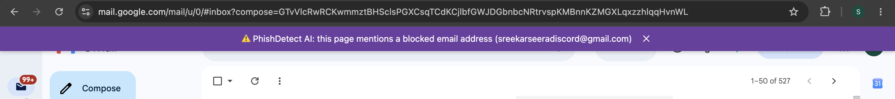

# PhishDetect AI 🚫📩

A Chrome extension + FastAPI backend that detects scam and phishing messages using machine learning. Paste a suspicious message into the popup, get an instant scam/safe verdict with a confidence score, and build a blocklist of scam sender emails — the extension then warns you with a banner on any page where a blocked email appears, in real time.

Built for a hackathon by **Sreekar, Smaran, Dhruv, and Shourya**.



*The live warning banner in action: the moment a blocked scam email is typed anywhere on a normal web page — here, a Gmail compose window — PhishDetect AI flags it instantly, with no page reload.*

## Features

- 🧠 ML-powered scam detection (TF-IDF + Logistic Regression, scikit-learn)
- 🧾 History log of analyzed messages, with sender email tracked per entry
- 🚫 Client-side blocklist of scam emails (stored in `chrome.storage.local`)
- 📢 Live warning banner on any webpage that mentions a blocked email — no page reload needed
- 💾 One-click export of history and blocklist to CSV
- 🎨 Clean minimalist UI (off-white / purple / gold)

## How it works

```
┌─────────────────────┐  POST /classify/ {"text": ...}  ┌──────────────────────┐
│  Chrome extension    │ ──────────────────────────────► │  FastAPI backend      │
│  popup.js            │ ◄────────────────────────────── │  app.py               │
│  (history/blocklist  │  {"label", "score",             │  scikit-learn model   │
│   in chrome.storage) │   "explanation"}                │  (model.joblib)       │
└─────────┬───────────┘                                  └──────────────────────┘
          │ blocklist (chrome.storage.local)
          ▼
┌─────────────────────┐
│  banner.js           │  content script — scans every page (and its iframes)
│                      │  for blocked emails and injects a warning banner
└─────────────────────┘
```

- The **backend is stateless** — it only classifies text. All history and blocklist data lives in the extension via `chrome.storage.local`.
- The model is a scikit-learn `Pipeline` (`TfidfVectorizer` → `LogisticRegression`) trained on `backend/dataset.csv` (280 labeled messages, balanced 140 scam / 140 legit).
- `banner.js` uses a `MutationObserver` (debounced) plus a `chrome.storage.onChanged` listener, so the banner appears the moment a blocked email shows up on a page or gets added to the blocklist — no reload required.

## Project structure

```
backend/
  app.py               FastAPI server — POST /classify/ only
  train_model.py       Trains the model, prints validation accuracy, saves model/model.joblib
  generate_dataset.py  Template-based generator that expands dataset.csv
  dataset.csv          Labeled training data (text,label — 1 = scam, 0 = legit)
  requirements.txt     fastapi, uvicorn, scikit-learn, pandas, joblib
extension/
  manifest.json        Chrome Manifest V3
  popup.html/js        Analyze UI, history, blocklist, CSV export
  banner.js            Content script — live blocked-email warning banner
  storage.js           chrome.storage.local wrapper (history + blocklist)
  util.js              CSV export + email regex extraction
  style.css            Popup styling
docs/                  Project plan, demo script, and example messages
tests/                 Automated end-to-end test suite (17 checks)
```

## Setup

### 1. Backend

```bash
cd backend
python3 -m venv venv
source venv/bin/activate
pip install -r requirements.txt

# Train the model (takes seconds)
python train_model.py

# Start the server
uvicorn app:app --reload
```

The API is now running at `http://localhost:8000`. Quick sanity check:

```bash
curl -X POST http://localhost:8000/classify/ \
  -H 'Content-Type: application/json' \
  -d '{"text":"Your account has been suspended, click here to verify"}'
```

> Note: open a **new terminal**? Run `source venv/bin/activate` again first — otherwise you'll get `command not found: uvicorn`.

### 2. Extension

1. Open `chrome://extensions` in Chrome
2. Turn on **Developer mode** (top right)
3. Click **Load unpacked** and select the `extension/` folder

## Using it

1. Click the PhishDetect AI icon to open the popup
2. Paste a suspicious message, optionally add the sender's email, and hit **Analyze**
3. Scam verdicts automatically add the sender email to the blocklist
4. Visit any page mentioning a blocked email → a purple warning banner appears at the top, live — even if the email is typed onto the page after it loaded
5. Export your history or blocklist to CSV anytime from the popup

## API contract

```
POST http://localhost:8000/classify/
Request:  {"text": "..."}
Response: {"label": "LABEL_0" | "LABEL_1", "score": <float 0-1>, "explanation": "<string>"}
```

`LABEL_1` = scam, `LABEL_0` = safe.

## Known limitations

- **Canvas-rendered apps (Google Docs, Sheets, Slides, Figma, Canva):** these apps paint text onto a `<canvas>` instead of putting it in the page DOM, so live-typed text is invisible to any extension — the banner only catches emails present when the page loads. Normal DOM-based sites (Gmail, Outlook, WhatsApp Web, Discord, regular websites) work in real time.
- **`chrome://` pages and `data:` URLs:** browsers block content scripts on these entirely — applies to every extension, not just this one.
- **Small iframes:** the banner uses `position: fixed`, so if the blocked email appears inside a small embedded iframe, the banner renders inside that iframe's box rather than across the full page.
- **Local-only backend:** the API is hardcoded to `localhost:8000` — a deliberate hackathon scope cut, not a deployment story.

## Testing

`python3 tests/run_all.py` runs 17 automated end-to-end checks (popup flow + live banner) in an invisible headless Chrome — about 30 seconds, no manual clicking. See `tests/README.md`. Run it before every push.

## Architecture decisions

A few choices were locked deliberately to keep the build focused: a lightweight scikit-learn model (rather than a heavy transformer stack), a stateless backend, and fixed API/storage contracts so the extension and backend never drift apart. See `docs/TASKS_OVERVIEW.md` for the full plan.
